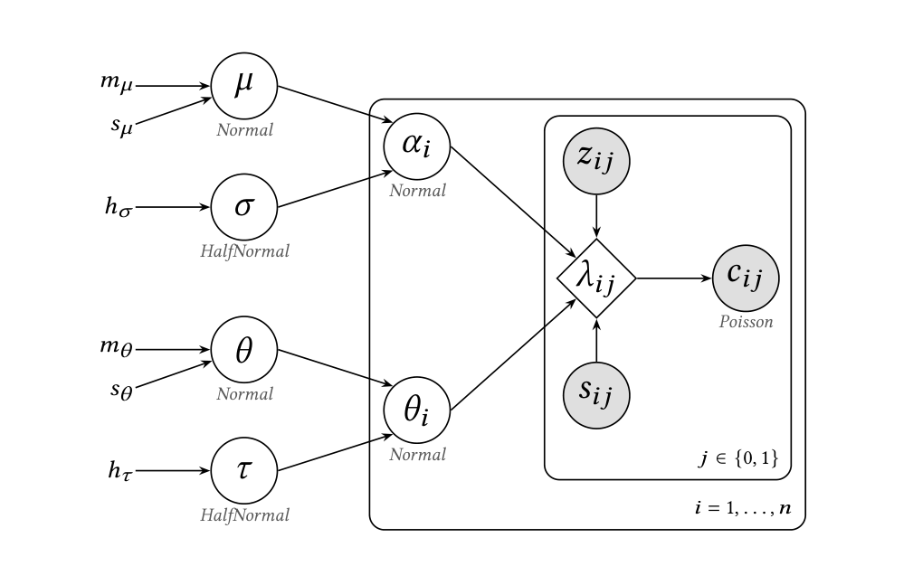

# ABTeaLab: Bayesian A/B Testing for Estimating Heterogeneous Treatment Effects in Online Advertising

Code accompanying the paper **"Estimating Heterogeneous Treatment Effects in Online Advertising Experiments: A Hierarchical Bayesian Approach"** by Aljoša Vodopija, Anže Alič, Tim Poštuvan, Martin Jakomin, and Blaž Škrlj (Teads), submitted to the AdKDD 2026 workshop at the ACM SIGKDD Conference on Knowledge Discovery and Data Mining.

## Abstract

We present a production hierarchical Bayesian framework for estimating heterogeneous treatment effects in large-scale online advertising experiments. By jointly modeling campaign-level effects and cross-campaign heterogeneity, it addresses a limitation of inverse-variance weighting, the standard meta-analytic baseline, which becomes unstable under high heterogeneity and sparse events. Across simulations spanning a range of effect sizes and heterogeneity regimes, the approach delivers more reliable inference under high heterogeneity while matching or improving estimation accuracy in most settings. We further demonstrate its practical value in a production demand-side platform that handles over 5 million requests per second, integrating it with a sequential testing procedure and evaluating it across three experiments covering over 35,000 campaigns from more than 3,000 advertisers.

## Model

Plate diagram of the proposed hierarchical Bayesian model. Unshaded circles are latent variables, shaded circles are observed, the diamond is a deterministic node, and bare symbols are fixed constants.

## Overview

This repository will host the implementation of the hierarchical Bayesian model and the Bayesian sequential testing pipeline (based on highest density intervals and regions of practical equivalence) described in the paper, together with the simulation studies used to compare against inverse-variance weighting baselines.

## Code availability

**The code will be released here only after the paper is accepted and published.**
